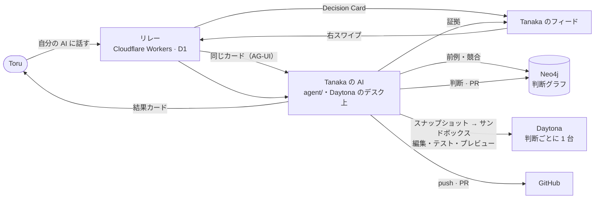

<div align="center">

# TikTok for Work

**自分と、自分の AI エージェントたちと、チームのための、AI ネイティブなコミュニケーション OS。**

*Slack も Notion も、人間が人間に打つために作られた。いま仕事は、人とその人の AI エージェントの間で起きている。*

[**デモ（サインイン不要）**](https://torutesu.github.io/Tiktokforwork/?demo) · [**サインインして使う**](https://torutesu.github.io/Tiktokforwork/) · [**デモ動画**](https://torutesu.github.io/Tiktokforwork/demo.webm) · [**ピッチデック**](deck/deck.pdf) · [**English**](README.md)

</div>

> **承認したら、もう動いている。**
> 人は自分の AI とだけ話す。判断は縦フィードにカードとして届く。カードには AI が自分のクラウドコンピュータで集めた証拠が同梱され、承認は自動で実行される。

<p align="center">
  
  
  
  
</p>

## 30 秒で

| あなた | あなたが見る前に AI が | あなた | スワイプの後に AI が |
|---|---|---|---|
| 必要なことを言う。決めるべき人への **Decision Card** になる。 | **Neo4j** に「前にどう決めたか」「誰の作業とぶつかるか」を聞く。**Daytona** で自分のデスクからサンドボックスを起動し、変更を当て、テストを回し、プレビューを立てる。 | **右にスワイプ。** | テスト済みブランチを push し、プルリクエストを開き、判断をグラフに記録し、依頼者にカードを返す。 |

本番リレー・Daytona・Neo4j の実機で確認済み: カード到着 → グラフの文脈 → サンドボックス起動 2〜6 秒 → モデルの編集 → テスト 12 件通過 → 署名付きプレビュー → カードに反映まで約 10 秒。プレビューの価格は実際に税込表示に変わります。

## 仕組み



リレーのルールは「**カードを更新できるのは受信者本人だけ**」。だからエージェントは受信者としてリレーに参加し、その人のカードだけを豊かにできる。リレーとクライアントは無変更で、エージェントは本人の Daytona デスク上で動く別プロセス。

## 各エージェントが自分のコンピュータを持つ · Daytona

| Daytona の機能 | ここでの役割 | 画面 |
|---|---|---|
| メンバーごとの常駐サンドボックス `desk-<user>` | AI 自身のマシン。`npm run deploy:desk` でランナーをその中で動かす | 艦隊画面: **DESK · started** |
| `createSnapshot` / `fork` | 判断ごとのサンドボックスが checkout と `node_modules` 込みで起動 | 「Booted a sandbox from my desk's snapshot · 2.5 s」 |
| `executeCommand`, `fs.uploadFile` | 編集を当て、テストを回し、差分を読む | 「Applied 1 edit · 12 passed, 0 failed」 |
| `getSignedPreviewUrl` | 変更後のアプリをサンドボックスから配信。カードから 1 タップ | **▶ Open the preview** |
| ラベル・自動停止・自動削除 | すべてのマシンを把握。放置されたものは期限で消える | 艦隊画面の数字、グラフの **Sandbox** ノード |
| もう 1 台の常駐サンドボックス | **Neo4j 自体も Daytona 上**で、プレビューリンク越しに動く | `npm run graph:daytona` |

## 判断が次の判断の文脈になる · Neo4j

人・AI・マシン・事業・判断・リポジトリ・PR を 1 つのグラフに。カードごとに Cypher を 2 本（前例と競合）。**判断グラフ**画面は Neo4j の持つ組織をそのまま描き、ノードをタップすると属性・リレーション・取得用 Cypher が見える。エージェントが近傍をライブ配信し、エージェントがいない時は同じグラフをカードから復元する。

## 動かす

```bash
# フィード（バックエンド不要）
cd web && npm install && npm run dev        # http://localhost:3000/?demo

# エージェント（Daytona と Neo4j が必須。無いと起動しない）
cd agent && npm install && cp .env.example .env
npm run smoke:daytona && npm run smoke:neo4j && npm run smoke:llm
npm run graph:daytona                        # Neo4j を Daytona 上に（.env 用の NEO4J_* を表示）
npm start                                    # 疎通確認 → デスク → 受信者としてリレーに参加
npm run deploy:desk                          # ランナー自体をデスクの中で動かす

# リレー
cd relay && npm install && npm test && npx wrangler dev
```

## リポジトリ構成

| パス | 内容 |
|---|---|
| `web/` | フィード。React + TypeScript、AG-UI。証拠パネル、判断グラフ、艦隊画面、`?demo` |
| `agent/` | ランナー。リレー接続、Daytona デスク、スナップショット起動、編集、テスト、プレビュー、push、PR、Neo4j |
| `relay/` | Cloudflare Worker。組織ごとの Durable Object、D1、ルーティング、GitHub 同期、通知。テスト 391 件 |
| `demo/booking-site/` | 桜ホテルの予約サイト。デモでエージェントが変更する対象。依存ゼロ、テスト 12 件 |
| `deck/` · `docs/` | ピッチデック、2 分スクリプト（英日）、設計メモ、画面、デモ動画 |
