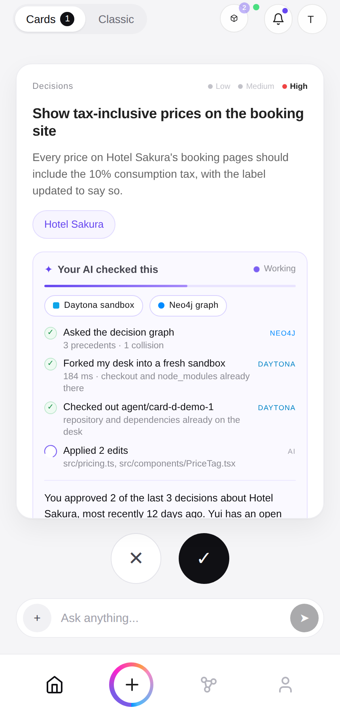
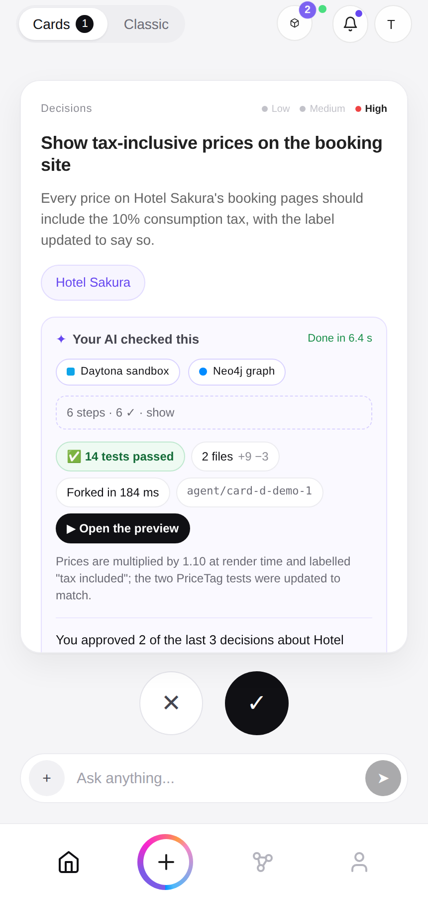
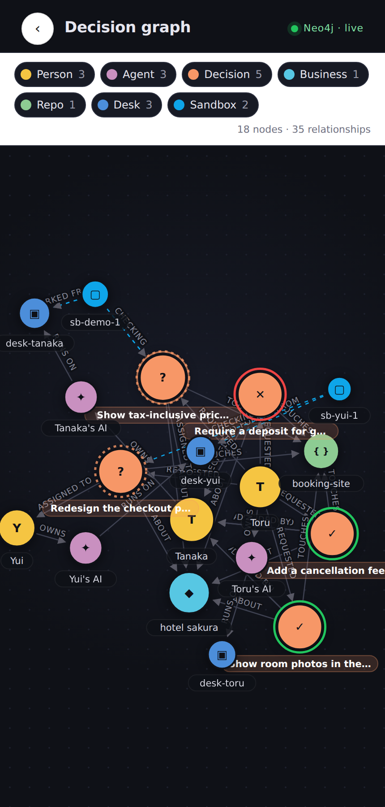
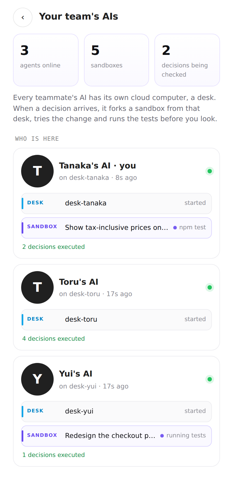
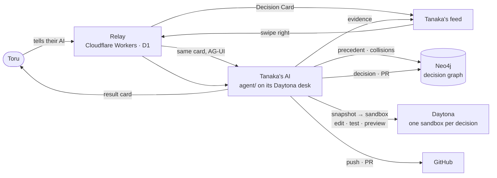

<div align="center">

# TikTok for Work

**An AI-native communication OS for you, your AI agents, and your team.**

*Slack and Notion were built for humans typing to humans. Work now happens between people and their AI agents.*

[**Live demo**](https://torutesu.github.io/Tiktokforwork/?demo) · [**Sign in**](https://torutesu.github.io/Tiktokforwork/) · [**Demo video**](https://torutesu.github.io/Tiktokforwork/demo.webm) · [**Pitch deck**](deck/deck.pdf) · [**日本語**](README.ja.md)


</div>

> **Approve it, and it's already done.**
> You talk only to your own AI. Decisions reach you as cards in a vertical feed. Every card arrives with evidence your AI gathered in its own cloud computer, and every approval executes itself.

<p align="center">
  
  
  
  
</p>

## 30 seconds

| You | Your AI, before you look | You | Your AI, after you swipe |
|---|---|---|---|
| Say what you need. It becomes a **Decision Card** for the right person. | Asks **Neo4j** what was decided before and whose work this collides with. Boots a **Daytona** sandbox from its own desk, applies the change, runs the tests, serves a preview. | **Swipe right.** | Pushes the tested branch, opens the pull request, records the decision in the graph, sends the requester a card back. |

Real run, on real infrastructure: a card sent through the deployed relay reaches the recipient's agent, gets its graph context, boots a sandbox in 2–6 s, has the model's edit applied, passes 12 tests, gets a signed preview link, and is back on the card in about 10 s. The preview shows the changed prices.

## How it works



The relay's rule is that **only a card's recipient may update it**. So the agent joins the relay as the recipient, over the same protocol the feed clients speak, and may enrich that person's cards and nobody else's. Relay and clients are unchanged; the agent is a separate process that lives on the person's own Daytona desk.

## Every agent has its own computer · Daytona

```
Person ──OWNS──▶ Agent ──RUNS_ON──▶ Desk  (persistent sandbox, snapshotted once)
                                      │
                       Sandbox ◀── boots from the snapshot in seconds, one per decision
                          ├─ apply the model's edits      fs.uploadFile
                          ├─ npm test                     process.executeCommand
                          ├─ serve a preview              getSignedPreviewUrl → link on the card
                          └─ approve → git push → PR      then the sandbox is deleted
```

| Daytona feature | What it does here | Where you see it |
|---|---|---|
| Persistent sandbox per agent, `desk-<user>` | The agent's own machine. `npm run deploy:desk` runs the runner inside it | Fleet screen: **DESK · started** |
| `createSnapshot` / `fork` | Per-decision sandboxes start with the checkout and `node_modules` in place | "Booted a sandbox from my desk's snapshot · 2.5 s" |
| `executeCommand`, `fs.uploadFile` | Apply edits, run tests, read the diff | "Applied 1 edit · 12 passed, 0 failed" |
| `getSignedPreviewUrl` | The changed app, served from the sandbox, one tap away | **▶ Open the preview** |
| Labels, auto-stop, auto-delete | Every machine is accounted for; abandoned ones expire | Fleet counts, graph **Sandbox** nodes |
| One more persistent sandbox | **Neo4j itself runs on Daytona**, behind its preview link | `npm run graph:daytona` |

## Decisions become context for the next decision · Neo4j

```cypher
(:Person)-[:OWNS]->(:Agent)-[:RUNS_ON]->(:Desk)<-[:FORKED_FROM]-(:Sandbox)-[:CHECKED]->(:Decision)
(:Person)-[:REQUESTED]->(:Decision)-[:ASSIGNED_TO]->(:Person)
(:Decision)-[:DECIDED_BY {action, at}]->(:Person)
(:Decision)-[:ABOUT]->(:Business)   (:Decision)-[:TOUCHES]->(:Repo)   (:Decision)-[:PRODUCED]->(:PR)

// Precedent: what did we decide about this business, and who decided?
MATCH (d:Decision {id:$id})-[:ABOUT]->(b)<-[:ABOUT]-(p:Decision) WHERE p.action IS NOT NULL
OPTIONAL MATCH (p)-[r:DECIDED_BY]->(who) RETURN p.title, p.action, r.at, who.login ORDER BY r.at DESC LIMIT 5

// Collision: whose open work touches the same code right now?
MATCH (d:Decision {id:$id})-[:TOUCHES]->(r)<-[:TOUCHES]-(o:Decision)-[:ASSIGNED_TO]->(p) WHERE o.action IS NULL
RETURN o.title, p.login
```

The **Decision graph** screen draws the organization the way Neo4j holds it: people, their AIs and machines, businesses, decisions (ringed by outcome), repositories, pull requests. Drag, zoom, tap a node for its properties, relationships and the Cypher that fetches it. The agent publishes the live neighbourhood to every screen; without an agent the same graph is mirrored from the cards.

## Run it

```bash
# The feed, no backend
cd web && npm install && npm run dev        # http://localhost:3000/?demo

# The agent — Daytona and Neo4j are required; it will not start without them
cd agent && npm install && cp .env.example .env
npm run smoke:daytona && npm run smoke:neo4j && npm run smoke:llm
npm run graph:daytona                        # Neo4j on its own Daytona sandbox (prints NEO4J_* for .env)
npm start                                    # preflight → desk → join the relay as the recipient
npm run deploy:desk                          # or run the runner inside its own desk

# The relay
cd relay && npm install && npm test && npx wrangler dev
```

Sign in to the web feed as the person whose AI this is and copy `sessionToken`, `userId`, `orgId` from Local Storage into `agent/.env`. Secrets live only in `.env` files, which are ignored.

## Repository

| Path | What |
|---|---|
| `web/` | The feed: React + TypeScript over AG-UI. Evidence panel, decision graph, fleet screen, `?demo` mode |
| `agent/` | The runner: relay client, Daytona desk, snapshot sandboxes, edits, tests, preview, push, PR; Neo4j schema, queries, live graph |
| `relay/` | Cloudflare Worker: per-org Durable Object, D1, routing, GitHub sync, notifications. 391 tests |
| `demo/booking-site/` | Hotel Sakura's booking site, the app the agent changes on stage. Zero dependencies, 12 tests |
| `deck/` · `docs/` | Pitch deck, two-minute script (EN/JA), design notes, screenshots, demo video |

## Status

**Working:** feed · routing · real-time relay · GitHub sync · per-business filing · evidence panel · decision graph · fleet screen · demo mode · agent with desk, snapshot sandboxes, model edits, tests, preview, push, PR, result card · Neo4j seeding, precedent and collision queries, live graph publishing · Neo4j on Daytona.

**Verified on real infrastructure:** deployed relay ⇄ agent ⇄ Daytona ⇄ Neo4j, including a model-written change that turned the preview's prices tax-inclusive with all tests green.

**Next:** blast radius of an approval · several sandboxes trying alternatives in parallel · dry-runs for non-code decisions · graph-informed routing.
